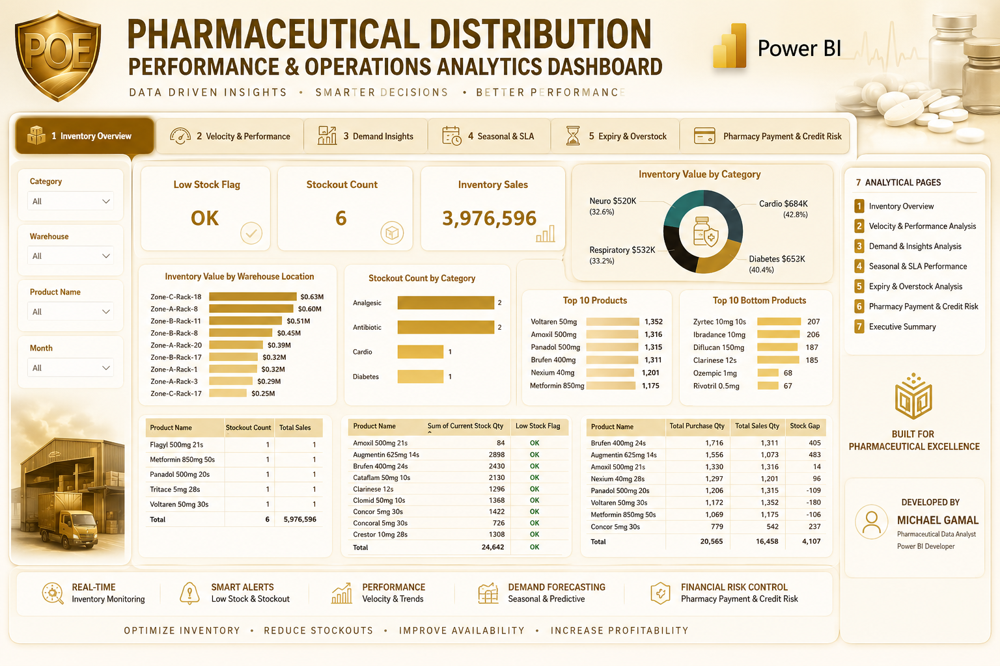
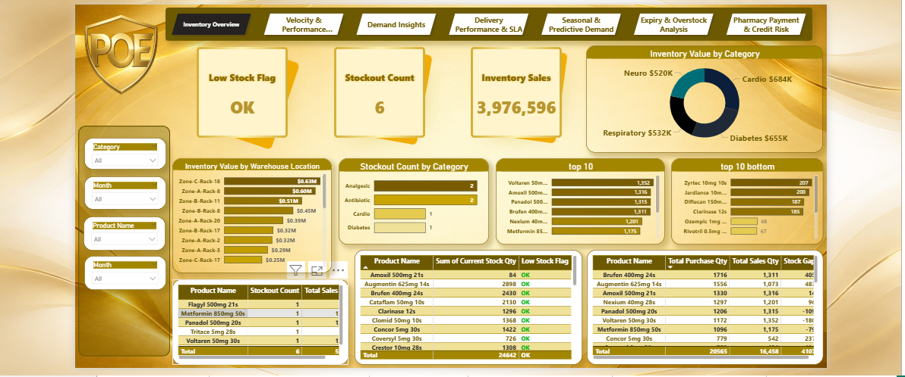
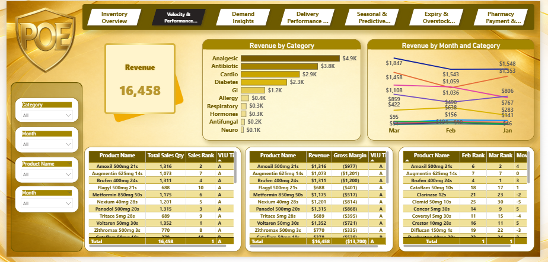
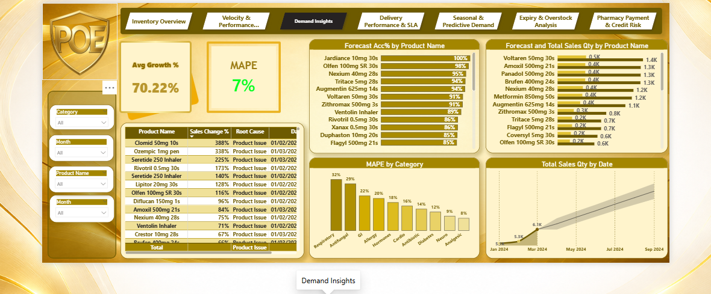
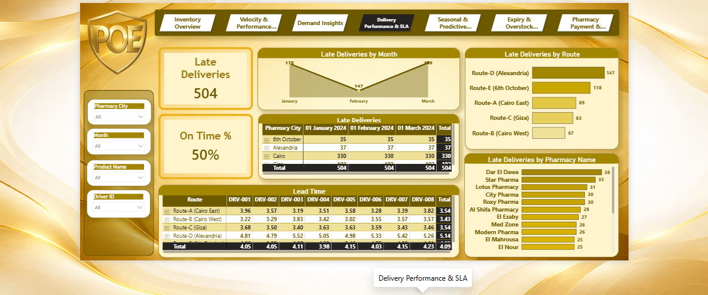
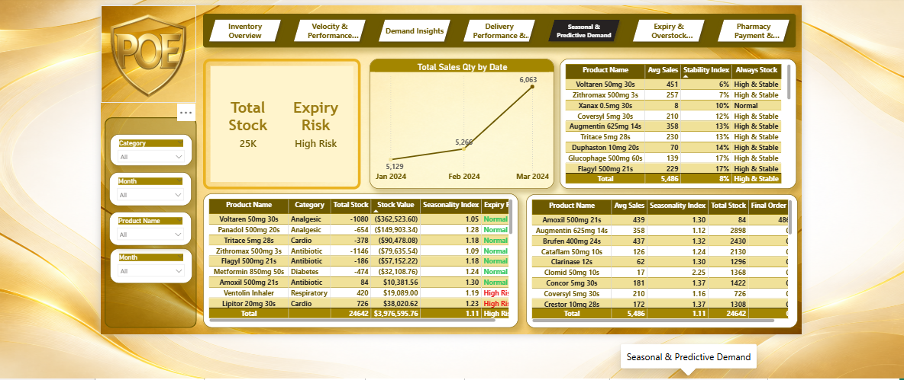
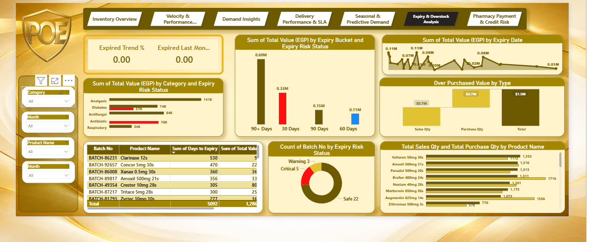
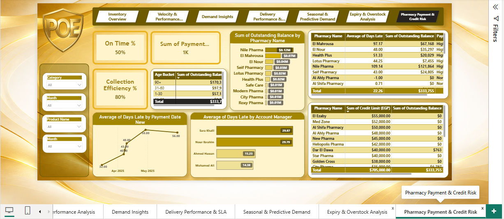

<div align="center">

# 🏥 Pharmaceutical Distribution Performance & Operations Analytics Dashboard

### End-to-End Business Intelligence Solution for Pharmaceutical Distribution Operations




</div>

---

# 📌 Table of Contents

* [Project Overview](#-project-overview)
* [Business Problem](#-business-problem)
* [Business Objectives](#-business-objectives)
* [Tools & Technologies](#-tools--technologies-used)
* [Dashboard Pages Breakdown](#-dashboard-pages-breakdown)
* [KPIs Monitored](#-key-kpis-monitored)
* [Business Insights](#-key-business-insights-delivered)
* [Project Impact](#-project-impact)
* [Developed By](#-developed-by)

---

# 🏥 Project Overview

This project represents a complete end-to-end analytical solution designed for the pharmaceutical distribution industry using Microsoft Power BI.

The dashboard was built to simulate real-world pharmaceutical distribution operations and provide deep business visibility into:

* Sales Performance
* Operational Efficiency
* Inventory Movement
* Customer Purchasing Behavior
* Returns Management
* Collection Performance
* Credit Risk Analysis
* Territory Performance
* Executive KPI Monitoring
* Demand Forecasting
* Delivery Performance
* Expiry Monitoring
* Inventory Optimization

With more than 15 years of pharmaceutical market experience, this project reflects not only technical analytical capabilities but also deep business understanding of pharmaceutical distribution operations within the Egyptian market.

The objective of this solution is transforming raw operational data into strategic business insights that support executive-level decision-making.

---

# 🚨 Business Problem

Pharmaceutical distribution companies generate massive amounts of operational and transactional data daily.

However, many organizations struggle with:

* Lack of centralized reporting
* Limited visibility into sales performance
* Weak inventory monitoring
* Poor returns tracking
* Difficulty monitoring collections and credit exposure
* Slow executive decision-making
* Operational inefficiencies across territories
* Inventory stockout risks
* Weak forecasting visibility
* Delivery performance issues
* Expiry and overstock risks

This dashboard was designed to solve these challenges by building a centralized analytical platform capable of monitoring the entire pharmaceutical distribution cycle.

---

# 🎯 Business Objectives

✅ Monitor overall pharmaceutical sales performance

✅ Track achievement against sales targets

✅ Analyze territory and regional performance

✅ Evaluate pharmacy and customer purchasing behavior

✅ Monitor operational efficiency and returns

✅ Analyze inventory movement and stock risks

✅ Improve collection performance and reduce credit risk

✅ Monitor demand forecasting accuracy

✅ Improve delivery SLA monitoring

✅ Reduce expiry and overstock risks

✅ Support strategic business decisions using data-driven insights

---

# 🛠 Tools & Technologies Used

| Technology            | Purpose                              |
| --------------------- | ------------------------------------ |
| Microsoft Power BI    | Dashboard Development                |
| Power Query           | Data Cleaning & Transformation       |
| DAX                   | KPI Calculations & Advanced Measures |
| Data Modeling         | Relationship Management              |
| Excel                 | Data Source Preparation              |
| Business Intelligence | Reporting & Insights                 |
| Data Storytelling     | Executive Reporting                  |
| Forecasting Analytics | Predictive Analysis                  |

---

# 🧠 Data Analytics Skills Demonstrated

* Business Intelligence Development
* Pharmaceutical Distribution Analytics
* KPI Design & Monitoring
* Executive Dashboard Design
* Data Visualization
* Operational Analysis
* Financial & Collection Analysis
* Inventory Analytics
* Credit Risk Monitoring
* Advanced DAX Development
* Forecasting & Predictive Analytics
* Delivery SLA Monitoring
* Storytelling with Data

---

# 📊 Dashboard Pages Breakdown

---

# 📌 Page 1 — Executive Overview Dashboard



## 🔍 Overview

The Executive Dashboard provides a high-level overview of overall business performance and acts as the primary monitoring page for executive management.

## 📈 Key Insights Included

* Inventory Sales → 3,976,596
* Current Stock Monitoring
* Low Stock Flag Monitoring
* Top 10 Products
* Bottom 10 Products
* Inventory Distribution Analysis
* Warehouse Inventory Visibility
* KPI Monitoring Cards
* Business Health Indicators

## 💼 Business Value

Enables management to quickly identify inventory gaps, monitor stock movement, and improve pharmaceutical inventory control.

---

# 📌 Page 2 — Sales Performance Analysis



## 🔍 Overview

A detailed analytical view focused on pharmaceutical sales performance across products, customers, territories, and channels.

## 📈 Key Insights Included

* Total Revenue → 16,458
* Revenue by Category
* Revenue Trend by Month
* Gross Margin Analysis
* Product Ranking
* Sales Contribution Analysis
* Growth & Decline Tracking
* Customer Sales Distribution

## 💼 Business Value

Supports sales optimization, revenue growth analysis, and product performance monitoring.

---

# 📌 Page 3 — Customer & Pharmacy Analysis



## 🔍 Overview

Focused on predictive demand analysis and customer purchasing behavior monitoring.

## 📈 Key Insights Included

* Avg Growth % → 70.22%
* Forecast Accuracy (MAPE) → 7%
* Forecast vs Actual Analysis
* Customer Purchase Patterns
* Sales Growth Monitoring
* Category-Level Forecasting
* Product Demand Analysis

## 💼 Business Value

Improves forecasting visibility and enhances pharmaceutical demand planning accuracy.

---

# 📌 Page 4 — Territory & Regional Performance



## 🔍 Overview

Analyzes delivery operations, route efficiency, and SLA performance across geographical territories.

## 📈 Key Insights Included

* Late Deliveries → 504
* On-Time Delivery % → 50%
* Delivery Performance by Route
* Lead Time Monitoring
* SLA Tracking
* Territory Performance Analysis
* Delivery Trend Analysis

## 💼 Business Value

Helps management optimize logistics operations and improve delivery efficiency across territories.

---

# 📌 Page 5 — Returns & Operational Analysis



## 🔍 Overview

Monitors seasonal demand analysis and predictive operational planning.

## 📈 Key Insights Included

* Total Stock → 25K
* Seasonal Demand Analysis
* Product Stability Monitoring
* Avg Sales Tracking
* Final Order Recommendation
* Predictive Demand Planning
* Inventory Risk Indicators

## 💼 Business Value

Enhances inventory planning efficiency and improves operational forecasting capabilities.

---

# 📌 Page 6 — Inventory & Stock Movement



## 🔍 Overview

Provides visibility into expiry monitoring, inventory movement, and overstock risk analysis.

## 📈 Key Insights Included

* Expiry Risk Monitoring
* Expired Trend %
* Expiry Bucket Analysis
* Overstock Monitoring
* Product Movement Analysis
* Sales vs Purchase Quantity
* Stock Risk Indicators

## 💼 Business Value

Supports inventory optimization and helps reduce pharmaceutical expiry and overstock losses.

---

# 📌 Page 7 — Collection & Credit Risk Analysis



## 🔍 Overview

Focused on financial monitoring, collection performance, and customer credit risk management.

## 📈 Key Insights Included

* Collection Efficiency % → 80%
* Outstanding Balance → $333.7K
* Avg Payment Delay Days
* Credit Limit Monitoring
* High-Risk Pharmacies
* Age Bucket Analysis
* Account Manager Performance

## 💼 Business Value

Improves financial stability, collection monitoring, and pharmacy credit risk management.

---

# 📈 Key KPIs Monitored

| KPI | Description |
| --------------------- | ----------------------------- |
| Inventory Sales | 3,976,596 |
| Revenue | 16,458 |
| Avg Growth % | 70.22% |
| Forecast Accuracy (MAPE) | 7% |
| Late Deliveries | 504 |
| On-Time Delivery % | 50% |
| Collection Efficiency % | 80% |
| Outstanding Balance | $333.7K |
| Total Stock | 25K |
| Inventory Efficiency | Stock movement efficiency |
| Product Performance | Product sales contribution |

---

# 💡 Key Business Insights Delivered

✔ Identified inventory stockout and low-stock risks

✔ Highlighted high-performing and low-performing products

✔ Improved visibility into forecasting accuracy and demand planning

✔ Enhanced delivery monitoring and SLA performance tracking

✔ Improved inventory monitoring and expiry risk visibility

✔ Improved collection monitoring and financial visibility

✔ Enabled faster executive-level strategic decision-making

✔ Built a centralized pharmaceutical business monitoring solution

---

# 🚀 Project Impact

This dashboard demonstrates the power of combining:

* Business Domain Expertise
* Advanced Analytics
* Data Visualization
* Operational Intelligence
* Executive Reporting
* Forecasting Analytics
* Supply Chain Monitoring

The project reflects strong capabilities in both technical analytics and pharmaceutical business operations.

---

# 🏗 Data Flow Architecture

```text
Raw Data Sources
       ↓
Excel / Operational Data
       ↓
Power Query Transformation
       ↓
Data Modeling
       ↓
DAX Measures & KPIs
       ↓
Interactive Power BI Dashboards
       ↓
Executive Decision Making
```

---


---

# 🧩 Enterprise Data Modeling Architecture


## 🔍 Overview

The solution was designed using a scalable enterprise-style data model optimized for analytical performance, flexibility, and business intelligence reporting.

The architecture combines operational, financial, forecasting, inventory, delivery, and risk management datasets into a centralized analytical framework.

The data model was carefully structured to support:

- High-performance dashboard interactions
- Advanced DAX calculations
- Forecasting analytics
- Credit risk monitoring
- Operational KPI tracking
- Supply chain analysis
- Inventory optimization
- Executive reporting

---

# 🏗 Data Model Structure

## 📦 Fact Tables

| Table | Purpose |
|---|---|
| 1_Inventory_Sales | Inventory movement and sales monitoring |
| 2_Expiry_Inventory | Expiry risk and overstock analysis |
| 3_Delivery_Logs | Delivery operations and SLA tracking |
| 4_Pharmacy_Payments | Payment collection and outstanding balances |
| 8_SKU_Demand_12Month | Historical demand forecasting |
| 11_Sales_Rep_Performance | Sales representative monitoring |
| 12_Demand_Forecast | Forecasting and demand prediction |
| 13_Churn_Prediction | Customer churn analysis |
| 14_Credit_Risk | Pharmacy financial risk scoring |

---

## 🧾 Dimension Tables

| Table | Purpose |
|---|---|
| 5_SKU_Master | Product master data |
| 6_Pharmacy_Master | Pharmacy business profiles |
| 7_Supplier_Master | Supplier operational data |
| 9_Pharmacy_Profile | Pharmacy segmentation |
| Date | Centralized date intelligence |

---

# ⚡ Advanced DAX Engineering

The dashboard includes advanced DAX calculations designed for executive-level business monitoring and operational intelligence.

## 📈 Key DAX Measures Developed

- Inventory Sales KPIs
- Revenue Growth %
- Forecast Accuracy (MAPE)
- Collection Efficiency %
- Outstanding Balance
- On-Time Delivery %
- Stockout Detection Logic
- Expiry Risk Indicators
- Product Stability Index
- Demand Forecast Accuracy
- SLA Breach Monitoring
- Credit Risk Classification
- Churn Probability Indicators
- Payment Delay Analysis
- Gross Margin Analysis

---

# 🧠 Business Logic & Analytical Framework

The dashboard was designed using real-world pharmaceutical operational logic including:

- Inventory lifecycle monitoring
- Forecasting-based inventory planning
- Risk-based pharmacy classification
- Delivery SLA performance tracking
- Credit exposure monitoring
- Product demand behavior analysis
- Pharmacy relationship scoring
- Financial collection monitoring
- Operational efficiency measurement

---

# 📊 Risk & Forecasting Intelligence

## 🔥 Credit Risk Engine

The Credit Risk model evaluates pharmacies using:

- Payment delay history
- Outstanding balances
- Active credit exposure
- Unpaid invoices
- Default probability
- Relationship score
- SLA breaches

This logic helps identify:

- High-risk pharmacies
- Collection risks
- Potential payment defaults
- Financial exposure areas

---

## 📈 Demand Forecasting Model

The forecasting engine analyzes:

- Historical sales trends
- Product seasonality
- Product velocity
- Growth behavior
- Demand fluctuations
- Forecast accuracy

Key forecasting metrics include:

- Forecast Accuracy (MAPE) → 7%
- Avg Growth → 70.22%
- Product Demand Stability
- Final Order Recommendation

---

# 🚀 Performance Optimization Techniques

Several optimization techniques were implemented to ensure dashboard scalability and performance:

- Star Schema Modeling
- Optimized Relationships
- Measure Tables
- Dedicated Date Table
- DAX Optimization
- Reduced Cardinality
- Centralized KPI Logic
- Reusable Measures
- Business-Oriented Naming Convention

---

# 📂 Measure Organization

A dedicated measure table was implemented to centralize all KPI calculations and improve maintainability.

Examples include:

- Card Measures
- Forecast Measures
- Risk Measures
- Velocity Measures
- Collection Measures
- Delivery KPI Measures

---

# 🎯 Enterprise Analytics Capabilities

This solution demonstrates advanced capabilities in:

- Enterprise Data Modeling
- Advanced DAX Development
- Forecasting Analytics
- Pharmaceutical Operations Analytics
- Supply Chain Intelligence
- Financial Risk Analytics
- Executive Dashboard Development
- Operational Performance Monitoring
- Business Intelligence Architecture

---

# 👨‍💻 Developed By

# Michael Gamal

### Pharmaceutical Data Analyst | Power BI Developer | Business Intelligence Analyst

With strong pharmaceutical market experience and deep understanding of pharmaceutical distribution operations, this project was designed to bridge the gap between raw operational data and executive-level strategic insights.

---

# 📂 Project Files Included

* Power BI Dashboard (.pbix)
* Dashboard Screenshots
* README Documentation
* Data Model
* DAX Measures
* KPI Calculations
* Business Analysis
* Forecasting Analysis

---

# ⭐ Support The Project

If you found this project valuable:

✅ Star the repository

✅ Follow for more analytics projects

✅ Connect with me on LinkedIn & GitHub

---

<div align="center">

## 🚀 Turning Pharmaceutical Operations Into Strategic Business Intelligence

</div>
